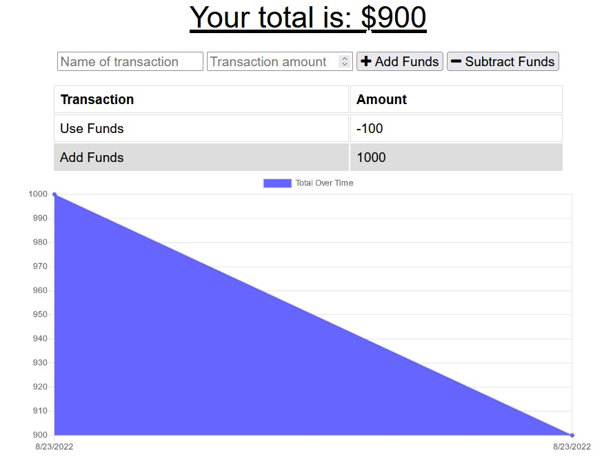

# Budget Tracker
 

## Description
This is an application that allows you to add and subtract funds. It provides a graph showing you the status of your account over time. It was built with starter code and programmed to use IndexedDB and Service Workers to allow offline access.

## Technologies Used
* Node.js
* Express.js
* MongoDB
* Mongoose
* IndexedDB
* Service Workers

### Deployed Application
[https://avandefeniks-budget-tracker.herokuapp.com/](https://avandefeniks-budget-tracker.herokuapp.com/)

### Created by
Angel Van de Feniks
